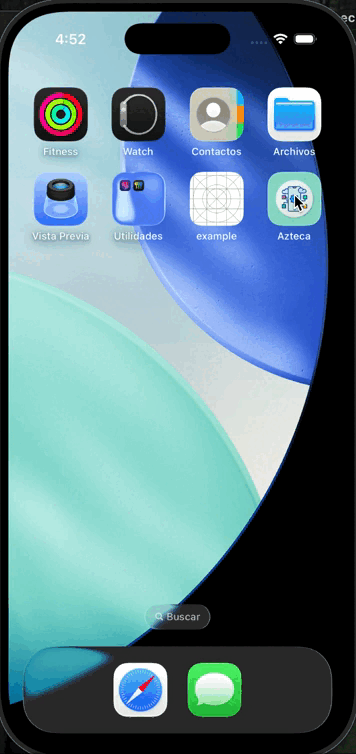

# PruebaAzteca

Proyecto que muestra algunas funciones con tablas en iOS

## 🛠️ Requirimientos
* Xcode 26.2 o posterior
* iOS v18.0 o posterior

## 📋 Instrucciones
### Abrir el archivo Azteca.xcodeproj
### Ejecutar el proyecto en emulador o dispositivo físico

## 🧩 Arquitectura
### Se utiliza una arquitectura MVVM con Coordinator en todo el proyecto, ya que esta nos ayuda con:

- Escalabilidad del proyecto
- Separa responsabilidades
- Facilita las pruebas unitarias
- Facil de mantener
    
## 📹 Evidencia
### Funcionamiento

## ⏰ Pendientes
- [x] Persistencia de datos
- [x] Separar los elementos gráficos en un SPM reutilizable
- [x] Pruebas unitarias

## 📚 Librerias externas
- Ninguna

## 👨🏻‍💻 Autor
Ignacio Hernández, ignacio.hm@icloud.com

